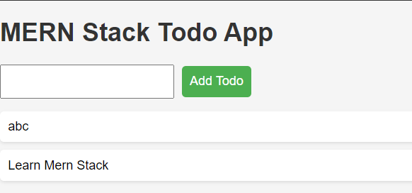

**MERN Stack Todo App**

**Description:**

This is a simple yet powerful to-do application built using the MERN stack: MongoDB, Express.js, React.js, and Node.js. It allows you to create, manage, and track your tasks in a user-friendly interface ☑️.

**Features:**

- Add new tasks with ease ➕
- Update existing tasks with details ✏️
- Mark tasks as complete ✅
- Delete tasks when they're done ️
- Intuitive user interface for a smooth workflow 

**Technologies Used:**

- **Frontend:** React.js ⚛️
- **Backend:** Express.js ⚡, Node.js ⬢
- **Database:** MongoDB ️

**Installation:**

1. Clone this repository: `git clone https://github.com/your-username/mern-stack-todo-app.git`
2. Install dependencies: `npm install`
3. Start the development server: `npm start` (This will typically launch the app in your web browser, often at http://localhost:3000/)

**Usage:**

1. Open the app in your browser (refer to Installation step 3).
2. Create new tasks by entering them in the input field and clicking the "Add Task" button ➕.
3. Update existing tasks by clicking on them and modifying the content. Press Enter to save changes ✏️.
4. Mark tasks as complete by clicking the checkbox next to them ✅.
5. Delete tasks by clicking the trash can icon next to them ️.

**Screenshots:**

**Contributing:**

We appreciate any contributions to this project! Please feel free to fork the repository, make changes, and submit pull requests.

**License:**

This project is licensed under the MIT License. See the `LICENSE` file for more details.
